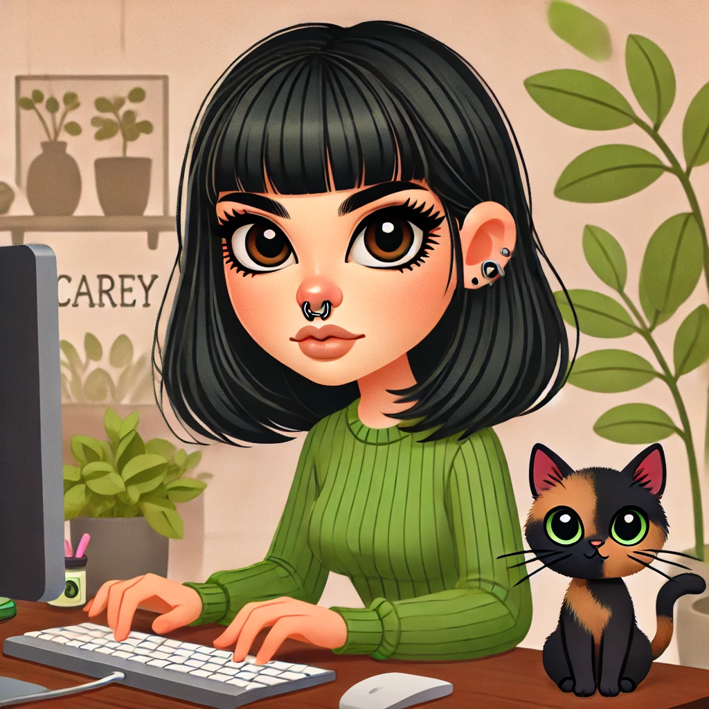

# Programación con objetos I
## Presentación Personal

### Datos Personales
- Mi nombre es Camila Micaela Montalbano
- Vivo en Villa Tesei
- Tengo 28 años
- Estoy en el segundo año de la carrera de Programación y me gustaría hacer la simultaneidad con la carrera de IA

### Información Random
- Tengo una gata carey como la de la imagen que se llama Arveja
- He usado git y gitHub, pero sigo intentando amigarme con las herramientas, especialmente git
- Exitos a todos en la cursada
